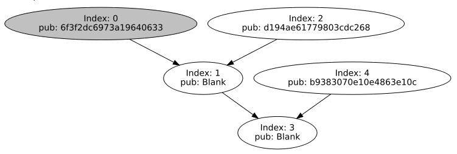
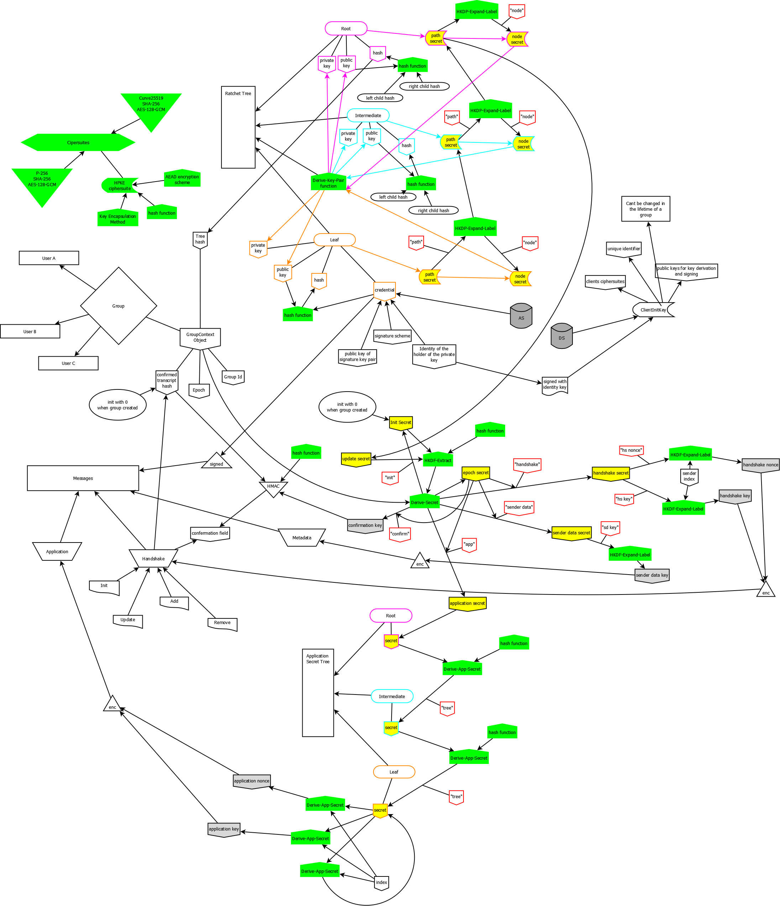

# MLS Explained

⚠️⚠️ **NEVER USE THIS CODE IN PRODUCTION** ⚠️⚠️

⚠️⚠️ **THIS IS AN INSECURE IMPLEMENTATION** ⚠️⚠️

⚠️⚠️ **ONLY FOR ACADEMIC PURPOSES** ⚠️⚠️


The MLS-Explained project tries to provide insight into the inner workings 
of the [mls protocol](https://datatracker.ietf.org/doc/draft-ietf-mls-protocol/) 
[version 7](https://datatracker.ietf.org/doc/draft-ietf-mls-protocol/07/).



It contains three pieces of software written in python: 
An implementation of mls (called libMLS), an implementation of a dirserver 
[based on version 3](https://datatracker.ietf.org/doc/draft-ietf-mls-architecture/03/) 
of the [mls architecture rfc](https://datatracker.ietf.org/doc/draft-ietf-mls-architecture/) and a GUI application
which includes a simple "chat protocol" which aims to visualize the inner workings of mls.

## Status of the implementation

What has been implemented?
- Group creation
- Add Messages
- Update Messages
- Exchange of application messages
- Message packing, passing and processing between remote clients

**➡️ Everything that makes this protocol work for simple chat applications** 


What it is not implemented?
- Application Message Trees
- Signature checking
- Message encryption
- Mitigation of side channel attacks
- Init messages (these have beed removed in later protocol drafts)
- Remove messages

**➡️ Everything that would make this protocol secure** 

## Target audience

This repository is of interest for those who want to understand how exactly MLS works without being involved in
the development process for ages. It aims to implement all the basic concepts of the protocol while removing everything
that obstructs understanding.

Please take note that this implementation is the result of a two semester project course. Many code comments are still
in German and most likely won't be translated as the project duration has ended. For the same reason a lot of "hacks"
can be found, especially in the gui clients, which we never came around to fix. 

## Where to start?

If you really want to dig into our code I suggest you start with the test in `libMLS/tests`. These were maintained
quite well and we achieved a solid 85% (solid for a academic project that is) percent test coverage. Especially
`libMLS/test/test_communication.py` could be a good point to start, you could e.g. take a look at 
`test_session_can_be_created_from_welcome` to know how we create a simple chat group with two users.

We also employed our version of ["literate programming"](https://en.wikipedia.org/wiki/Literate_programming), which 
means that you can find relevant parts of the mls rfc in the code where we implemented them. An example of this can
be found in `libMLS/libMLS/cipher_suite.py`.

As a last word of warning: Do not start you journey through our code with the infrastructure projects - 
they may seem to be the natural starting point (especially the gui clients), but they are the least tested and were 
thrown together to survive a few presentations.

## Building

This project uses the [nix build system](https://nixos.org/nix/). After installation you can build the project by
running `nix-build` in the project root. No other dependencies are needed. `nix-build` also executes all tests as well
as a linter.

After the build process is finished the binaries will be available in the `result` folder.

## Running

The GUI of this project can be run using `./result/infrastructure/bin/mls-chat-client-gui`. You can 
start any number of gui instances to simulate a small communication. 
You'll also need to start the dirserver at `./result/infrastructure/bin/mls-dir-server`.

## Project structure

```
.
├── infrastructure
│   ├── chatclient
│   ├── dirserver
│   └── tests
├── integration_test
└── libMLS
    ├── libMLS
    └── tests

    
```

`libMLS`: Implementation of MLS Protocol Version 7

`infrastructure`: 
- `dirserver`: Implementation of a simple Directory & Auth Server
- `chatclient`: A simple chat client in two versions: A command line interface and a qt-based gui application

`integration_test`: A bash script running multiple cli chat clients verify that basic interaction works

## 🎁Bonus content🎁

Here is a little bonus content, we thought would be too helpful to let it rot in our internal repo: 

A diagram illustrating how different secrets in mls interact:
